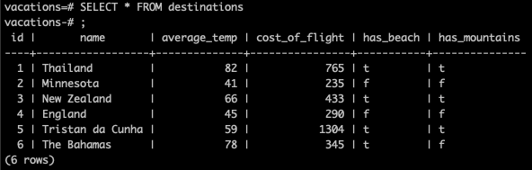
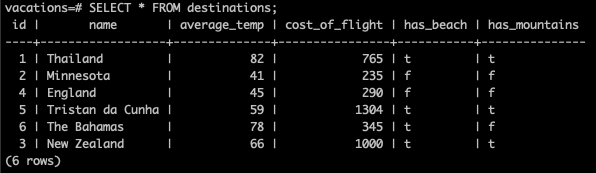
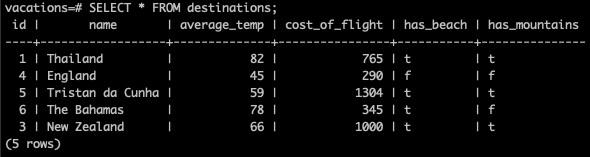

# Challenges

## 1. If you want to embed images, this is how you do it:

## 2. All of the vacation destinations.

## 3. All destinations where you can swim at the beach.

## 4. All destinations where the average temperature is over 60 degrees.

## 5. All destinations where you can swim at the beach AND go to the mountains.

## 6. All destinations where flights cost less than $500 and you can hike in the mountains.

## 7. Add an entry for The Bahamas, where the average temperature is 78, it has beaches but no mountains, and the flights cost $345.

## 8. Turns out, the cost of flights to New Zealand has increased! Update New Zealand's entry for flight cost to $1000.

## 9. Turns out, Minnesota isn't a vacation destination. Please delete it from the database.

## 10. When the data set was written, the author mistakently wrote "England" when they actually meant "Scotland". Please update that entry in the database.

## 11. Create a join table that joins the airlines and the destinations tables by correlating which airlines fly to which destinations.

## 12. All airlines that fly to New Zealand.

## 13. All airlines that do NOT fly to Scotland.

## 14. All of the data for all vacation destinations.